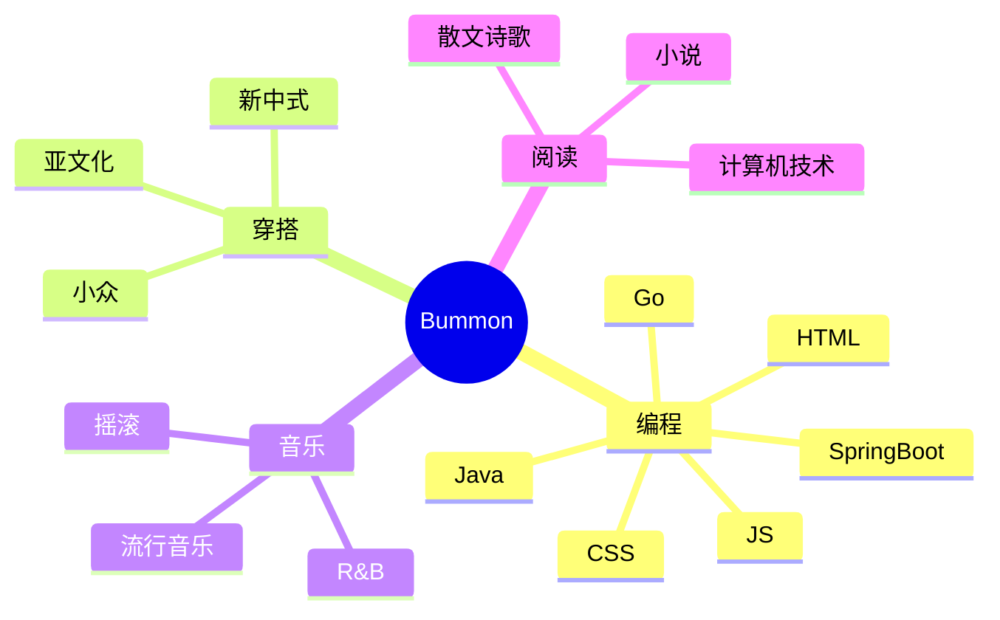

<div align="center">

  <!-- dynamic typing effect 动态打字效果 -->
  <div align="center">
    <a href="https://blog.sunguoqi.com/">
      
    </a>
  </div>
  <!-- knock code pictures 敲代码的图片 -->
  <br>

  <!-- profile logo 个人资料徽标 -->
  <div align="center">
    <a href="https://www.bummon.com/" target="_blank"></a>&emsp;
    <a href="https://blog.bummon.com/" target="_blank"></a>&emsp;
    <a href="https://www.bummon.com/wechat" target="_blank"></a>&emsp;
    <a href="https://juejin.cn/user/4068655792665464" target="_blank"></a>&emsp;
    <a href="https://blog.csdn.net/HackAzrael" target="_blank"></a>&emsp;
    <!-- visitor statistics logo 访客数统计徽标 -->
    
  </div>

  <!-- Snake Code Contribution Map 贪吃蛇代码贡献图 -->
<picture>
  <source media="(prefers-color-scheme: dark)" srcset="https://cdn.jsdelivr.net/gh/Bummon/Bummon/profile-snake-contrib/github-contribution-grid-snake-dark.svg" />
  <source media="(prefers-color-scheme: light)" srcset="https://cdn.jsdelivr.net/gh/Bummon/Bummon/profile-snake-contrib/github-contribution-grid-snake.svg" />
  
</picture>

</div>

#  🙋 Hello

<table>
<tr><td>
<!-- About me 关于我 -->

### 🤺 About Me


<p>&emsp;&emsp;Hi 👋, 我是Bummon</p>
<p>&emsp;&emsp;热爱编程、读书、穿搭、音乐。</p>
<p>&emsp;&emsp;热爱Java和IT互联网事业，励志成为一名优秀的开发者。</p>
<p>&emsp;&emsp;生如芥子，心藏须弥</p>
<br>

</td></tr>

<tr>
<td>

### 🏢 Work Experience


- [中音讯谷科技有限公司](https://www.zyxgkj.com/) &emsp; 📌 2021-10-08 —— Now
  
  - 工作岗位：Java开发工程师
  - 工作内容：会议相关
  <br>

  

</td>
</tr>

<tr><td>

<!-- 近期博客 -->

### 📃 Recent Blog


<!-- START_SECTION:blog -->
* <a href='http://blog.bummon.com/blog/2911343079.html' target='_blank'>【力扣】633.平方数之和</a> - 2023-08-17
* <a href='http://blog.bummon.com/blog/1333859299.html' target='_blank'>【力扣】167.两数之和II -  输入有序数组</a> - 2023-08-14
* <a href='http://blog.bummon.com/blog/215376691.html' target='_blank'>教你如何使用AES加密接口参数</a> - 2023-08-08
* <a href='http://blog.bummon.com/blog/1577368297.html' target='_blank'>教你如何实现接口防刷</a> - 2023-08-04
* <a href='http://blog.bummon.com/blog/4185626414.html' target='_blank'>简单几步学会使用多数据源</a> - 2023-07-24
<!-- END_SECTION:blog -->

</td></tr>

<tr><td>

### 🤾‍♂️ Funny Soul


<!-- START_SECTION:douban -->
* <a href='http://movie.douban.com/subject/26302614/' target='_blank'>在看请回答1988</a> 🌟🌟🌟🌟🌟 力荐- 2023-08-14
* <a href='https://book.douban.com/subject/34898994/' target='_blank'>最近在读Java核心技术·卷 I（原书第11版）</a> - 2023-08-05
* <a href='https://book.douban.com/subject/34778574/' target='_blank'>读过夏天、烟火和我的尸体</a> - 2023-08-05
* <a href='http://movie.douban.com/subject/1292052/' target='_blank'>看过肖申克的救赎</a> - 2023-08-05
* <a href='http://movie.douban.com/subject/1292220/' target='_blank'>看过情书</a> - 2023-08-05
<!-- END_SECTION:douban -->

</td></tr>

<tr><td>

<!-- wakatime 统计 -->
### 📊 WakaTime

<picture>
  <source
    srcset="https://github-readme-stats.vercel.app/api/wakatime?username=Bummon&layout=compact&text_color=f0f6fc&bg_color=00000000&hide_border=true&hide_title=true"
    media="(prefers-color-scheme: dark)"
  />
  <source
    srcset="https://github-readme-stats.vercel.app/api/wakatime?username=Bummon&layout=compact&text_color=1f2328&bg_color=00000000&hide_border=true&hide_title=true"
    media="(prefers-color-scheme: light), (prefers-color-scheme: no-preference)"
  />
  
</picture>

</td></tr>

<tr><td>

<!--START_SECTION:waka-->
**I'm an Early 🐤** 

```text
🌞 Morning                91 commits          ██████░░░░░░░░░░░░░░░░░░░   23.82 % 
🌆 Daytime                145 commits         █████████░░░░░░░░░░░░░░░░   37.96 % 
🌃 Evening                76 commits          █████░░░░░░░░░░░░░░░░░░░░   19.90 % 
🌙 Night                  70 commits          █████░░░░░░░░░░░░░░░░░░░░   18.32 % 
```
📅 **I'm Most Productive on Tuesday** 

```text
Monday                   44 commits          ███░░░░░░░░░░░░░░░░░░░░░░   11.52 % 
Tuesday                  90 commits          ██████░░░░░░░░░░░░░░░░░░░   23.56 % 
Wednesday                36 commits          ██░░░░░░░░░░░░░░░░░░░░░░░   09.42 % 
Thursday                 68 commits          ████░░░░░░░░░░░░░░░░░░░░░   17.80 % 
Friday                   65 commits          ████░░░░░░░░░░░░░░░░░░░░░   17.02 % 
Saturday                 54 commits          ████░░░░░░░░░░░░░░░░░░░░░   14.14 % 
Sunday                   25 commits          ██░░░░░░░░░░░░░░░░░░░░░░░   06.54 % 
```


📊 **This Week I Spent My Time On** 

```text
🕑︎ Time Zone: Asia/Shanghai

💬 Programming Languages: 
Java                     15 hrs 3 mins       ████████████████░░░░░░░░░   65.25 % 
XML                      4 hrs 17 mins       █████░░░░░░░░░░░░░░░░░░░░   18.61 % 
Markdown                 1 hr 35 mins        ██░░░░░░░░░░░░░░░░░░░░░░░   06.88 % 
Python                   1 hr 10 mins        █░░░░░░░░░░░░░░░░░░░░░░░░   05.13 % 
SQL                      50 mins             █░░░░░░░░░░░░░░░░░░░░░░░░   03.66 % 

🔥 Editors: 
IntelliJ                 16 hrs 8 mins       █████████████████░░░░░░░░   69.95 % 
WebStorm                 4 hrs 56 mins       █████░░░░░░░░░░░░░░░░░░░░   21.42 % 
PyCharm                  1 hr 10 mins        █░░░░░░░░░░░░░░░░░░░░░░░░   05.13 % 
DataGrip                 48 mins             █░░░░░░░░░░░░░░░░░░░░░░░░   03.50 % 

💻 Operating System: 
Windows                  23 hrs 3 mins       █████████████████████████   99.94 % 
Mac                      0 secs              ░░░░░░░░░░░░░░░░░░░░░░░░░   00.06 % 
```


 Last Updated on 20/08/2023 00:31:23 UTC
<!--END_SECTION:waka-->

</td></tr>
</table>

<!-- ########################################## 分割 ########################################## -->


<div align="center" >



<!-- just img 图片 -->


<!--  skill badge 技能徽章 -->
💪 正在学习


🧠 计划学习


🧰 常用的工具


<!-- programming tool icon 编程工具图标 -->
<br>

<!-- svg -->


 


<br>

<!-- gif -->
<!--


-->
<!-- just img 图片 -->
</div>

<!-- profile-3d-contrib 3D贡献图-->

</div>

<!-- ########################################## 分割 ########################################## -->


<div align="center" >

<!-- Github-Stats-Terminal 终端风格信息 -->
<br>

<!-- Quotes 名人名言 -->
<br>

<!-- GitHub 数据统计 -->

<br><br>

<!-- WakaTime 编码天数统计 Last Year -->
<picture>
  <source media="(prefers-color-scheme: dark)" srcset="https://wakatime.com/share/@Bummon/d89becc4-d1a1-42d5-af3c-90ef8b90a25e.svg" />
  <source media="(prefers-color-scheme: light)" srcset="https://wakatime.com/share/@Bummon/739ab478-f412-4f76-bf2b-c70e0cf3494f.svg" />
  
</picture>

<!-- WakaTime 编码天数统计 AllTime -->
<!--
<picture>
  <source media="(prefers-color-scheme: dark)" srcset="https://wakatime.com/share/@Bummon/0cb9bac9-5bb0-4421-92f8-662e8c5c9b26.svg" />
  <source media="(prefers-color-scheme: light)" srcset="https://wakatime.com/share/@Bummon/51c5e815-4409-4928-a515-d69079dccf7d.svg" />
  
</picture>
-->

<!-- GitHub 奖杯🏆 -->
<br>

<!-- Awesome repo 比较好的仓库-->
<!--
<a href="https://github.com/Bummon/Awesome-Love-Code">
</a>
<a href="https://github.com/Bummon/Student-Data-Vision">
</a><br><br>
-->

<table>
<!-- CSDN 社交统计 -->
  <tr>
  </tr>
<!-- Wakatime Graph-->
  <tr>
    <td></td>
    <td></td>
  </tr>
</table>
</div>

<!-- ########################################## 分割 ########################################## -->


<div align="center">

<!-- run 图片 -->


<!-- Joke 笑话 -->
<div></div>

<!-- CSDN 社交统计 -->
<div>
  
</div>

<!-- github-readme-streak-stats 连续提交代码天数记录 -->
&emsp;

&emsp;

<!-- metrics 基础资料 -->
&emsp;

&emsp;

<!-- GitHub Activity Graph GitHub 活动图 -->
<table align="center">
  <tr>
    <td></td>
  </tr>
</table>

</div>

<!-- ########################################## 分割 ########################################## -->


<!-- GitHub metrics 信息指标 -->
<div align="center">

<!-- first form 第一个表格 -->
<!--
<table>
  <tr>
    <td></td>
  </tr>
</table>
-->
<!-- second form 第二个表格 -->
<!--
<table>
  <tr>
    <td></td>
    <td></td>
  </tr>
  <tr>
    <td></td>
    <td></td>
  </tr>
  <tr>
    <td></td>
    <td></td>
  </tr>
  <tr>
    <td></td>
    <td></td>
  </tr>
  <tr>
    <td></td>
    <td></td>
  </tr>
  <tr>
    <td></td>
    <td></td>
  </tr>
</table>
-->

<!--

-->
<!-- just img 图片 -->

</div>
