<div align="center">
  
  <!-- dynamic typing effect 动态打字效果 -->
  <div align="center">
    <a href="https://blog.sunguoqi.com/">
      
    </a>
  </div>

  <!-- knock code pictures 敲代码的图片 -->
  <br>

  <!-- profile logo 个人资料徽标 -->
  <div align="center">
    <a href="https://bummon.github.io/"></a>&emsp;
    <!--<a href="https://box.sunguoqi.com/weixin_mp"></a>&emsp;-->
    <a href="https://space.bilibili.com/128806811"></a>&emsp;
    <a href="https://blog.csdn.net/HackAzrael"></a>&emsp;
    <!-- visitor statistics logo 访客数统计徽标 -->
    
  </div>

  <!-- Snake Code Contribution Map 贪吃蛇代码贡献图 -->
<picture>
  <source media="(prefers-color-scheme: dark)" srcset="https://cdn.jsdelivr.net/gh/Bummon/Bummon/profile-snake-contrib/github-contribution-grid-snake-dark.svg" />
  <source media="(prefers-color-scheme: light)" srcset="https://cdn.jsdelivr.net/gh/Bummon/Bummon/profile-snake-contrib/github-contribution-grid-snake.svg" />
  
</picture>

</div>

#  🙋 Hello

<table>
<tr><td>

<!-- About me 关于我 -->
### 🤺 About Me


<p>&emsp;&emsp;Hi 👋, 我是Bummon</p>
<p>&emsp;&emsp;热爱编程、读书、穿搭、音乐。</p>
<p>&emsp;&emsp;热爱Java和IT互联网事业，励志成为一名优秀的开发者。</p>
<p>&emsp;&emsp;展望世界，设计未来</p>
<br>

</td></tr>

<tr>
<td>
  
### 🏢 Work Experience


- [中音讯谷科技有限公司](https://www.zyxgkj.com/) &emsp; 📌 2021-10-08 —— Now
  
  - 工作岗位：Java开发工程师
  - 工作内容：会议相关
  <br>
 
  
</td>
</tr>

<tr><td>


<!-- 近期博客 -->
### 📃 Recent Blog
  


<!-- START_SECTION:blog -->
* <a href='https://bummon.github.io/blog/4185626414.html' target='_blank'>简单几步学会使用多数据源</a> - 2023-07-24
* <a href='https://bummon.github.io/blog/1811393859.html' target='_blank'>简单高效的轻量级表达式引擎：Aviator</a> - 2023-07-23
* <a href='https://bummon.github.io/blog/2082552432.html' target='_blank'>JVM 学习笔记二：JVM 内存</a> - 2023-07-22
* <a href='https://bummon.github.io/blog/855067016.html' target='_blank'>JVM 学习笔记一：JVM 概览</a> - 2023-07-20
* <a href='https://bummon.github.io/blog/1001383397.html' target='_blank'>SpringBoot 自动装配源码剖析</a> - 2023-07-17
<br>
<!-- END_SECTION:blog -->

</td></tr>

<tr><td>

<!--
### 🧠 Second Brain


-->

<!-- START_SECTION:brain -->
<!--
* <a href='https://brain.sunguoqi.com/ai/basic/test.html' target='_blank'>前言</a> - 2023-07-21
* <a href='https://brain.sunguoqi.com/dv/basic/test.html' target='_blank'>前言</a> - 2023-07-21
* <a href='https://brain.sunguoqi.com/en/basic/test.html' target='_blank'>前言</a> - 2023-07-21
* <a href='https://brain.sunguoqi.com/web/css/test.html' target='_blank'>前端学习路线</a> - 2023-07-21
* <a href='https://brain.sunguoqi.com/slides/' target='_blank'>目录</a> - 2023-07-21
-->
<!-- END_SECTION:brain -->

</td></tr>

<tr><td>

### 🤾‍♂️ Funny Soul


<!-- START_SECTION:douban -->
* <a href='https://book.douban.com/subject/34778574/' target='_blank'>最近在读《夏天、烟火和我的尸体》</a> 🌟🌟🌟🌟🌟 力荐- 2023-07-11
* <a href='http://movie.douban.com/subject/1292052/' target='_blank'>看过肖申克的救赎</a> 🌟🌟🌟🌟🌟 力荐- 2023-03-18
* <a href='https://movie.douban.com/subject/3011091/' target='_blank'>看过忠犬八公的故事</a> 🌟🌟🌟🌟🌟 力荐- 2023-03-18
* <a href='https://music.douban.com/subject/34466420/' target='_blank'>听过鲨鱼</a> 🌟🌟🌟🌟🌟 力荐- 2023-02-07
<br>
<!-- END_SECTION:douban -->

</td></tr>

<tr><td>

<!-- wakatime 统计 -->
### 📊 WakaTime

<picture>
  <source
    srcset="https://github-readme-stats.vercel.app/api/wakatime?username=Bummon&layout=compact&text_color=f0f6fc&bg_color=00000000&hide_border=true&hide_title=true"
    media="(prefers-color-scheme: dark)"
  />
  <source
    srcset="https://github-readme-stats.vercel.app/api/wakatime?username=Bummon&layout=compact&text_color=1f2328&bg_color=00000000&hide_border=true&hide_title=true"
    media="(prefers-color-scheme: light), (prefers-color-scheme: no-preference)"
  />
  
</picture>

</td></tr>

<tr><td>

<!--START_SECTION:waka-->


**🐱 My GitHub Data** 

> 📦 31.9 kB Used in GitHub's Storage 
 > 
> 🏆 78 Contributions in the Year 2023
 > 
> 🚫 Not Opted to Hire
 > 
> 📜 2 Public Repositories 
 > 
> 🔑 4 Private Repositories 
 > 
**I'm a Night 🦉** 

```text
🌞 Morning                11 commits          ███░░░░░░░░░░░░░░░░░░░░░░   13.10 % 
🌆 Daytime                21 commits          ██████░░░░░░░░░░░░░░░░░░░   25.00 % 
🌃 Evening                22 commits          ███████░░░░░░░░░░░░░░░░░░   26.19 % 
🌙 Night                  30 commits          █████████░░░░░░░░░░░░░░░░   35.71 % 
```
📅 **I'm Most Productive on Tuesday** 

```text
Monday                   7 commits           ██░░░░░░░░░░░░░░░░░░░░░░░   08.33 % 
Tuesday                  32 commits          ██████████░░░░░░░░░░░░░░░   38.10 % 
Wednesday                8 commits           ██░░░░░░░░░░░░░░░░░░░░░░░   09.52 % 
Thursday                 9 commits           ███░░░░░░░░░░░░░░░░░░░░░░   10.71 % 
Friday                   15 commits          ████░░░░░░░░░░░░░░░░░░░░░   17.86 % 
Saturday                 4 commits           █░░░░░░░░░░░░░░░░░░░░░░░░   04.76 % 
Sunday                   9 commits           ███░░░░░░░░░░░░░░░░░░░░░░   10.71 % 
```


📊 **This Week I Spent My Time On** 

```text
🕑︎ Time Zone: Asia/Shanghai

💬 Programming Languages: 
No Activity Tracked This Week

🔥 Editors: 
No Activity Tracked This Week

🐱‍💻 Projects: 
No Activity Tracked This Week

💻 Operating System: 
No Activity Tracked This Week
```

**I Mostly Code in Java** 

```text
Java                     2 repos             ██████████░░░░░░░░░░░░░░░   40.00 % 
HTML                     2 repos             ██████████░░░░░░░░░░░░░░░   40.00 % 
Stylus                   1 repo              █████░░░░░░░░░░░░░░░░░░░░   20.00 % 
```


**Timeline**


 Last Updated on 25/07/2023 07:54:03 UTC
<!--END_SECTION:waka-->
  
</td></tr>
</table>

<!-- ########################################## 分割 ########################################## -->


<div align="center" >



<!-- just img 图片 -->


<!--  skill badge 技能徽章 -->

```mermaid
mindmap
  root((Bummon))
    编程
      Java
      SpringBoot
    穿搭
      亚文化
      小众
      汉服
    音乐
      R&B
      流行音乐
    阅读
      计算机技术
      散文诗歌
      小说
      
```

💪 正在学习


  
🧠 计划学习


🧰 常用的工具


<!-- programming tool icon 编程工具图标 -->
<br>

<!-- svg -->


 


<br>

<!-- gif -->
<!--


-->
<!-- just img 图片 -->
</div>

<!-- profile-3d-contrib 3D贡献图-->

</div>

<!-- ########################################## 分割 ########################################## -->


<div align="center" >

<!-- Github-Stats-Terminal 终端风格信息 -->
<br>
  
<!-- Quotes 名人名言 -->
<br>
  
<!-- GitHub 奖杯🏆 -->
<br>

<!-- GitHub 数据统计 -->

<br><br>

<!-- Awesome repo 比较好的仓库-->
<!--
<a href="https://github.com/sun0225SUN/Awesome-Love-Code">
</a>
<a href="https://github.com/sun0225SUN/Student-Data-Vision">
</a><br><br>
-->
<!-- Wakatime Graph-->
<table>
  <tr>
    <td></td>
    <td></td>
  </tr>
  <tr>
    <td colspan="2"><a href="https://run.sunguoqi.com"></a><br></td>
  </tr>
</table>
</div>

<!-- ########################################## 分割 ########################################## -->


<div align="center">

<!-- run 图片 -->


<!-- Joke 笑话 -->
<div></div>

<!-- Github使用语言统计 -->


<!-- CSDN 社交统计 -->
<div>
  
</div>

<!-- github-readme-streak-stats 连续提交代码天数记录 -->
&emsp;

&emsp;

<!-- metrics 基础资料 -->
&emsp;

&emsp;

<!-- GitHub Activity Graph GitHub 活动图 -->
<table align="center">
  <tr>
    <td></td>
  </tr>
</table>

</div>

<!-- ########################################## 分割 ########################################## -->


<!-- GitHub metrics 信息指标 -->
<div align="center">

<!-- first form 第一个表格 -->
<!--
<table>
  <tr>
    <td></td>
  </tr>
</table>
-->
<!-- second form 第二个表格 -->
<!--
<table>
  <tr>
    <td></td>
    <td></td>
  </tr>
  <tr>
    <td></td>
    <td></td>
  </tr>
  <tr>
    <td></td>
    <td></td>
  </tr>
  <tr>
    <td></td>
    <td></td>
  </tr>
  <tr>
    <td></td>
    <td></td>
  </tr>
  <tr>
    <td></td>
    <td></td>
  </tr>
</table>
-->

<!--

-->
<!-- just img 图片 -->

</div>
